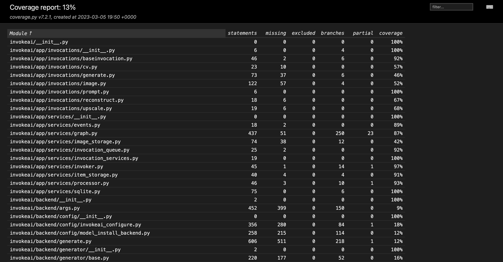
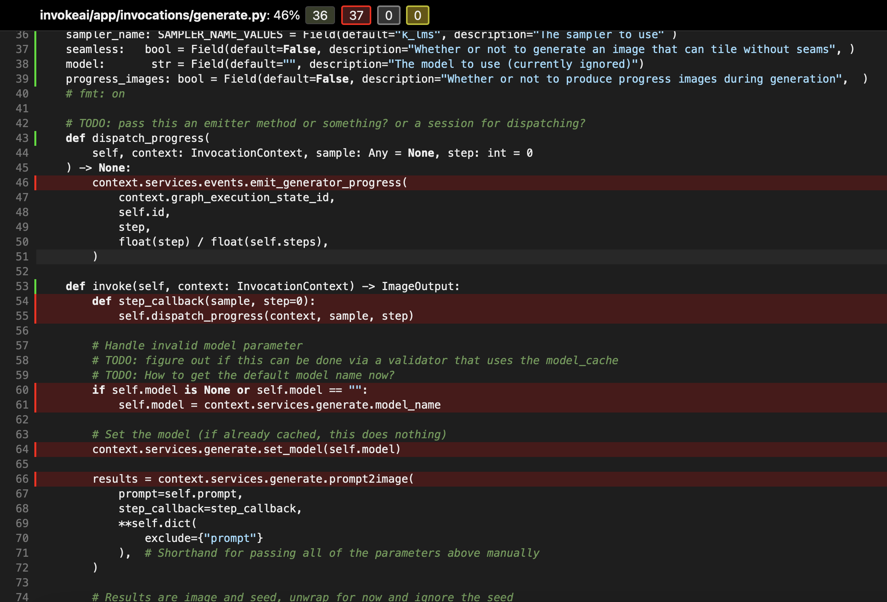

# Local Development

If you are looking to contribute you will need to have a local development
environment. See the
[Developer Install](../installation/020_INSTALL_MANUAL.md#developer-install) for
full details.

Broadly this involves cloning the repository, installing the pre-reqs, and
InvokeAI (in editable form). Assuming this is working, choose your area of
focus.

## Documentation

We use [mkdocs](https://www.mkdocs.org) for our documentation with the
[material theme](https://squidfunk.github.io/mkdocs-material/). Documentation is
written in markdown files under the `./docs` folder and then built into a static
website for hosting with GitHub Pages at
[invoke-ai.github.io/InvokeAI](https://invoke-ai.github.io/InvokeAI).

To contribute to the documentation you'll need to install the dependencies. Note
the use of `"`.

```zsh
pip install ".[docs]"
```

Now, to run the documentation locally with hot-reloading for changes made.

```zsh
mkdocs serve
```

You'll then be prompted to connect to `http://127.0.0.1:8080` in order to
access.

## Backend

The backend is contained within the `./invokeai/backend` folder structure. To
get started however please install the development dependencies.

From the root of the repository run the following command. Note the use of `"`.

```zsh
pip install ".[test]"
```

This in an optional group of packages which is defined within the
`pyproject.toml` and will be required for testing the changes you make the the
code.

### Running Tests

We use [pytest](https://docs.pytest.org/en/7.2.x/) for our test suite. Tests can
be found under the `./tests` folder and can be run with a single `pytest`
command. Optionally, to review test coverage you can append `--cov`.

```zsh
pytest --cov
```

Test outcomes and coverage will be reported in the terminal. In addition a more
detailed report is created in both XML and HTML format in the `./coverage`
folder. The HTML one in particular can help identify missing statements
requiring tests to ensure coverage. This can be run by opening
`./coverage/html/index.html`.

For example.

```zsh
pytest --cov; open ./coverage/html/index.html
```

??? info "HTML coverage report output"

    

    

## Front End

<!--#TODO: get input from blessedcoolant here, for the moment inserted the frontend README via snippets extension.-->

--8<-- "invokeai/frontend/web/README.md"
